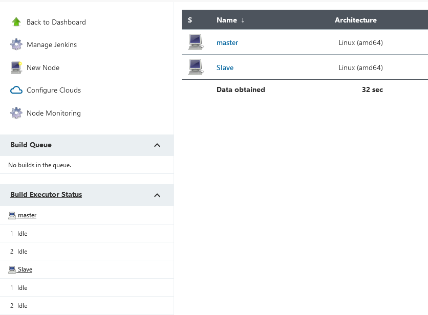
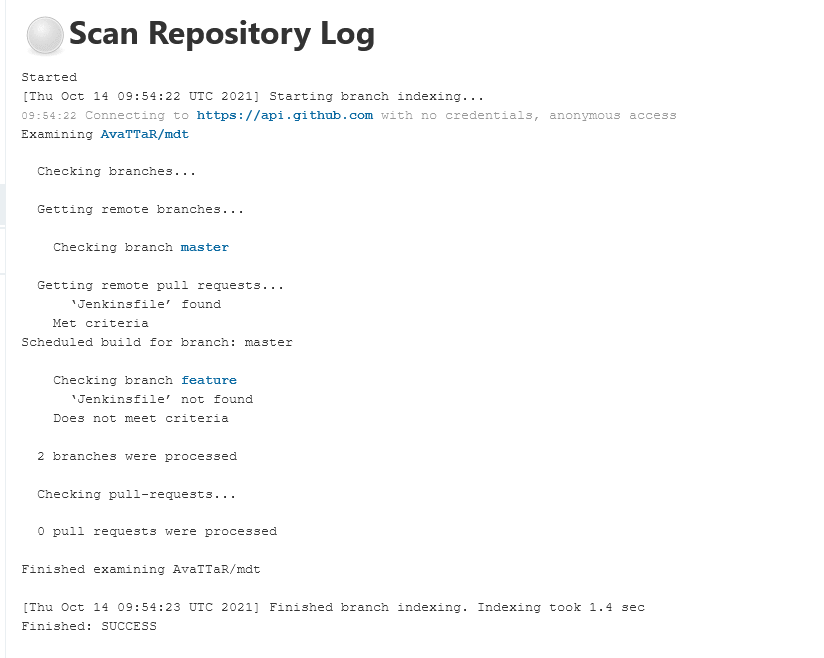
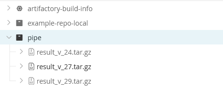

### 1. Create Jenkins VM with internet access:
##### install openjdk-8-jdk, Git
	sudo apt-get install -y openjdk-8-jdk git
##### install Jenkins with enabling autostart on startup
````sh
wget -q -O - https://pkg.jenkins.io/debian-stable/jenkins.io.key | sudo apt-key add - 
sudo sh -c 'echo deb https://pkg.jenkins.io/debian-stable binary/ > /etc/apt/sources.list.d/jenkins.list'
sudo apt-get update
sudo apt-get install -y jenkins 
sudo systemctl daemon-reload
sudo systemctl enable jenkins
sudo systemctl start jenkins
````
##### setup custom port 8081 for Jenkins 

Edit file /etc/default/jenkins `HTTP_PORT=8081`

	sudo systemctl restart jenkins

##### plugins – select plugins, add GitHub and Role-based authorization strategy

##### add new user – jenkins-NAME (your fullname, jenkins-linustorvalds)
User jenkins-iharyefimenka created.

------------


### 2. Create Agent VM
##### Install openjdk-8-jre, Git 

	sudo apt-get -y install openjdk-8-jre git 

##### prepare SSH keys
```
sudo adduser jenkins --shell /bin/bash
su jenkins
mkdir /home/jenkins/jenkins_slave
mkdir ~/.ssh && cd ~/.ssh
ssh-keygen -t rsa
cat id_rsa.pub > ~/.ssh/authorized_keys
su root
mkdir /var/lib/jenkins
chown jenkins:jenkins /var/lib/jenkins
```
##### connect agent to master node
Add node using ssh-key from id_rsa 




------------


### 3. Configure tools – NodeJS

##### Manage Jenkins -> Global tool configuration. Add NodeJS installations with version of NodeJS and global npm packages to install (uglify-js, clean-css-cli)
Install NodeJS plugin and provide configuration:


------------


### 4. Create “Multibranch Pipeline” pipeline job (work inside Lab folder)


Write Jenkinsfile which describes declarative pipeline
define NPM tools in pipeline section
Run in parallel stages for compressing JS, CSS files by using next utils:
Uglify-js
clean-css
www/css -> www/min
www/js -> www/min
### At this step I merged all css and js in one, if we want to have them compressed, but seppareted then we have to use commands:
	ls www/js/ | xargs -I@ uglifyjs www/js/@ -o www/min/@ --compress
	ls www/css/ | xargs -I@ cleancss www/css/@ -o www/min/@
create tar archive (ignore .git, css and js folders)
archive result




**[Check out Jenkinsfile](https://github.com/AvaTTaR/mdt/edit/master/Jenkinsfile "Check out Jenkinsfile")**
**[Check out Job Log](https://github.com/AvaTTaR/mdt/edit/master/Jenkinsfile "Check out Jenkinsfile")**

------------


### 5. Setup the GitHub webhook to trigger the jobs
##### Git plugin - http(s)://JENKINS_URL/git/notifyCommit?url=REPO_URL

##### Enable ‘Poll SCM’ in Job settings

Add triggers `{ pollSCM('0 0 * * *') }` [check out Jenkinsfile](https://github.com/AvaTTaR/mdt/edit/master/Jenkinsfile "check out Jenkinsfile")

##### GitHub plugin - http(s)://JENKINS_URL/github-webhook/

Create token on GitHub and add it to creds in Jenkins, next set this credentials to the GitHub plugin settings in Jenkins and enable “manage webhooks” 
Go to GitHub repository into Settings -> Webhooks -> Add Webhook 
Create webhook with url from advanced options of GitHub plugin (http://165.227.129.52:8081/github-webhook/) 
Select Pull and push events as trigers. 

##### Enable ‘GitHub hook trigger for Git SCM polling’

Add `githubPush()` to triggers section, [check out Jenkinsfile](https://github.com/AvaTTaR/mdt/edit/master/Jenkinsfile "check out Jenkinsfile")


------------

### Use Scripted pipeline instead of declarative
**[Check out scripted.Jenkinsfile](https://github.com/AvaTTaR/mdt/edit/master/scripted.Jenkinsfile "Check out scripted.Jenkinsfile")**
Checkout log.


### Spin up VM with installed Artifactory
```
wget -qO - https://api.bintray.com/orgs/jfrog/keys/gpg/public.key | sudo apt-key add - 
echo "deb https://jfrog.bintray.com/artifactory-debs bionic main" | sudo tee /etc/apt/sources.list.d/jfrog.list 
```
Edit /var/lib/apt/lists/jfrog.bintray.com_artifactory-debs_dists_bionic_main_binary-amd64_Packages so only last version remains in it (some issues with repo, is the easiest way to pass them) 
```
sudo apt update
sudo apt install jfrog-artifactory-oss -y
sudo systemctl start artifactory
sudo systemctl enable artifactory
```
### Add new stage for publishing artifacts into Artifactory
Use "Set me up" to generate link with hashed password to upload using curl

Stage deploy added, check out Jenkinsfile. Mark that in the final version I'm using jfrog.io as an artifact-repo. For first try I used my local envionment, but when I tried to use low-perfomance cloud VM it worked so slow, so I had to switch to jfrog free cloud solution as it works much faster than my instance in the cloud. Anyway, the only difference in our case will be the link we are using to upload artifacts.

